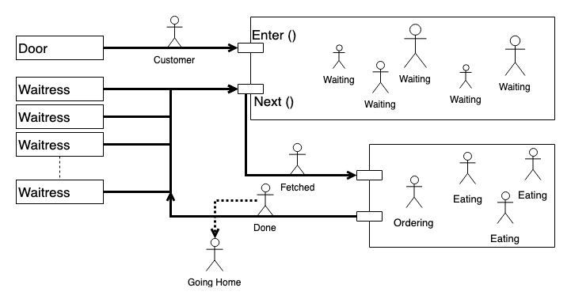

# TDT4186 Operating System

> [Practical Assignment](https://github.com/SmithPeder/java-threads/tree/master/lib)

#### Customer

`Customer` is the object passed around by the consumers and producers.

#### WaitingArea

`WaitingArea` is the shared resource/buffer of the program. Both the producer and the consumers try to access this object.

The object has to main function as you can see in the figure. `enter()` takes new customers and puts them in the waiting area. `next()` takes customers out of the waiting area. Both of these functions access the same pool of customers, here implemented as a `ArrayList`.

#### Door

`Door` is the producer of this simulation. The Door creates a new customer based on a global interval. The door thread calls the `enter()` method when it creates a new customer. If there is no room in the waiting area it will `wait()`. When it's allowed to place a customer in the waiting area it will call `notifyAll()`. This will signal all wait waitresses that a new customer is waiting to be fetched.

#### Waitress

`Waitress` is the consumer of this simulation. There are multiple waitresses that try to fetch customers from the waiting area. The waitresses call the `next()` method to fetch a new customer they can serve. If the waiting area is empty the waitress will `wait()`. If the waitress gets to fetch a customer they will call `notifyAll()` to signal to the Doors that there is room in the waiting area for a new customer.

### Helper Classes

#### Sushi bar

`Sushibar.java` is the main entry point to the simulation. It sets global variables and starts all the threads.

#### Clock

`Clock.java` is started at the beginning of the simulation, and when it gets to zero it sets the sushibar to closed.

#### SynchronizedInteger
`SynchronizedInteger.java` helps with keeping static counters stable

#### Output
`Output.java` helps prints to the terminal in different colors, to help differentiate what output comes from what thread.

### Wait(), nofify(), nofifyAll()

`wait()` sets the current thread (the one running the line) to wait indefinitely.

`nofity()` wakes up a thread that is set to wait().

`notifyAll()` wakes up all threads set to sleep by wait().

### Shared variables

All the shared variables are managed by using the `SynchronizedInteger` class. As all the method are declared using the `synchronized` keyword, only one Thread can access it at once.

List of shared variables.
  - SynchronizedInteger customerCounter;
  - SynchronizedInteger totalOrders;
  - SynchronizedInteger servedOrders;
  - SynchronizedInteger takeawayOrders;

There are also other shared resources. More specifically the shared `ArrayList` that holds `Customers`. This used by both the `Waitress` threads and the `Door` threads. This shared resource is also managed by declaring the functions are `synchronized`.

### Reporting final statistics

This is done by the main thread. When we `join()` all the waitresses, main is set to wait for them. So it will run the last bit of code when they terminate.
